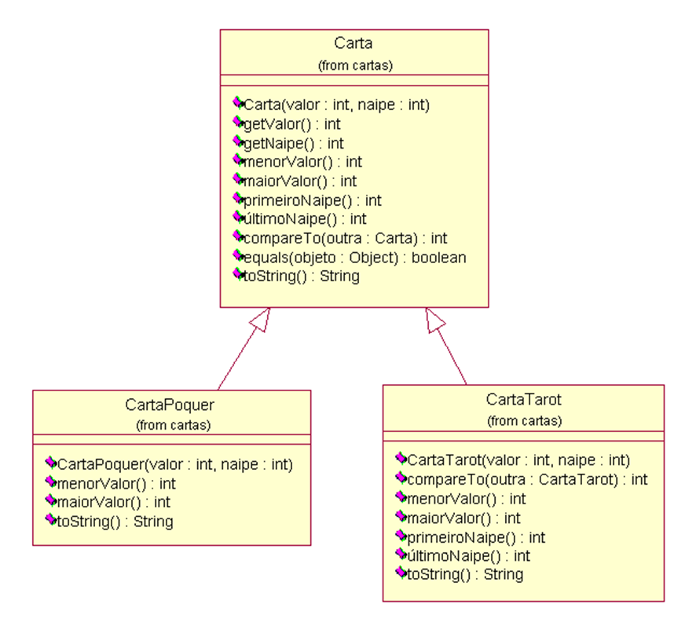
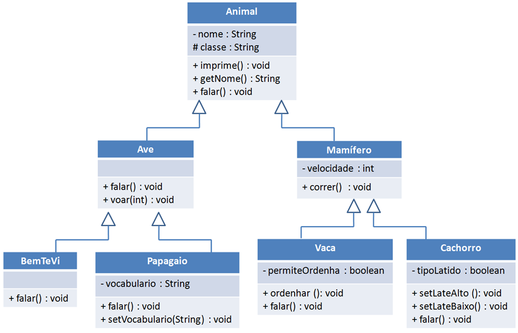
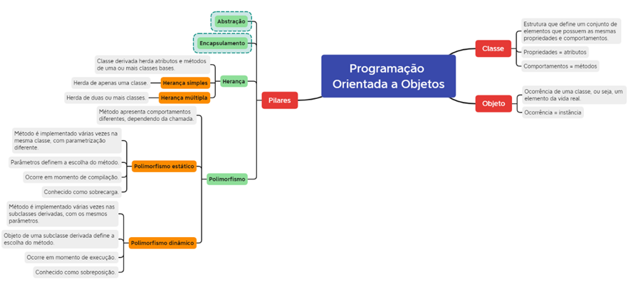

## Herança

A herança ocorre quando uma classe herda atributos e métodos de uma ou mais classes. Ela pode se dividir em 2 tipos:

- Herança simples: classe herda atributos e métodos de apenas uma classe.

- Herança múltipla: classe herda atributos e métodos de duas ou mais classes.

## Polimorfismo

O polimorfismo consiste em um mesmo método apresentar comportamentos diferentes, dependendo da classe em que seja chamado. Ele pode apresentar duas classificações:

- Polimorfismo estático: ocorre em momento de compilação. O mesmo método é implementado várias vezes na mesma classe, com parâmetros diferentes. A escolha do método a ser chamado vai variar de acordo com o parâmetro passado.

- Polimorfismo dinâmico: ocorre em momento de execução. O mesmo método é implementado várias vezes nas subclasses derivadas, com os mesmos parâmetros. A escolha do método depende do objeto que o chama (e, consequentemente, da classe que o implementa).

## Mapa Mental
